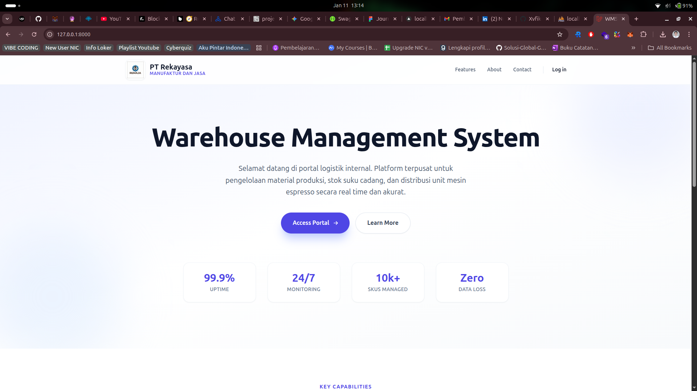
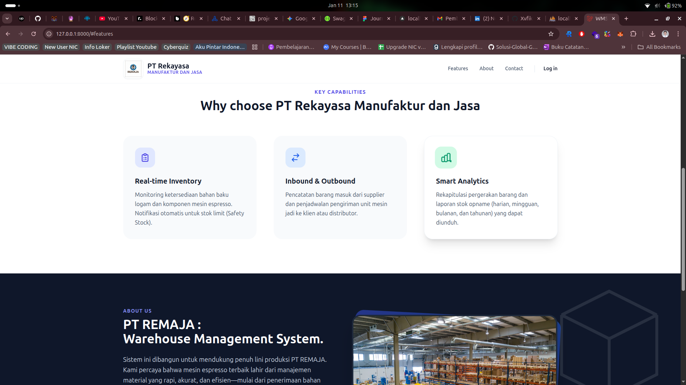
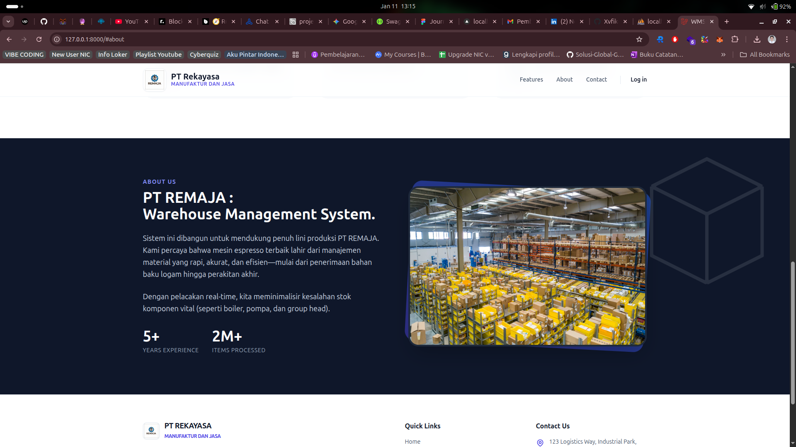
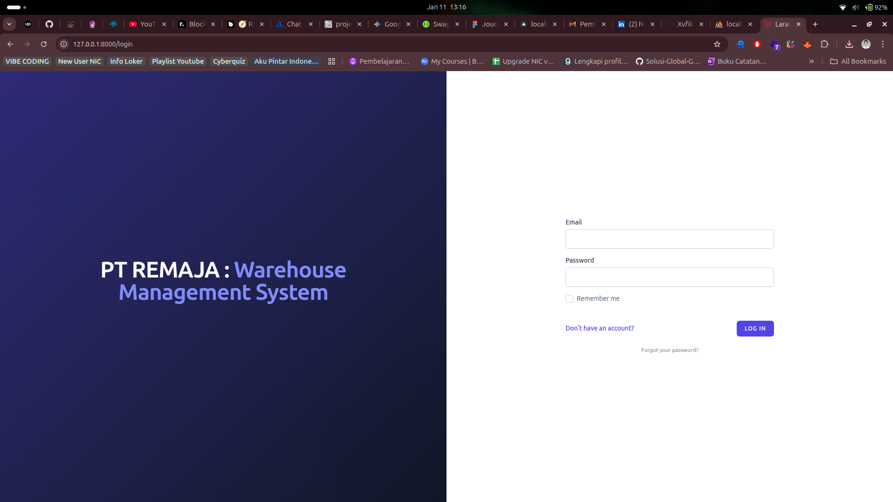
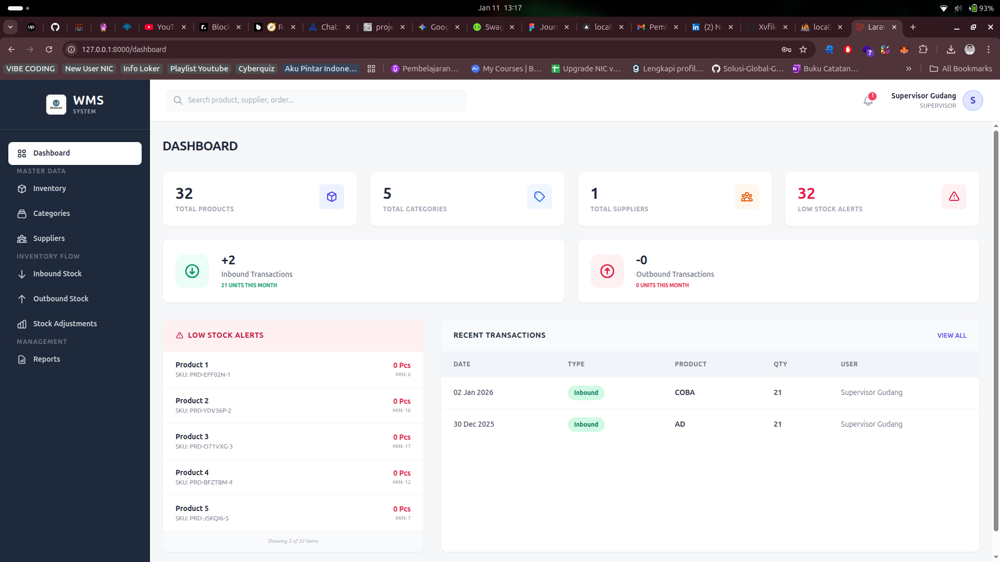
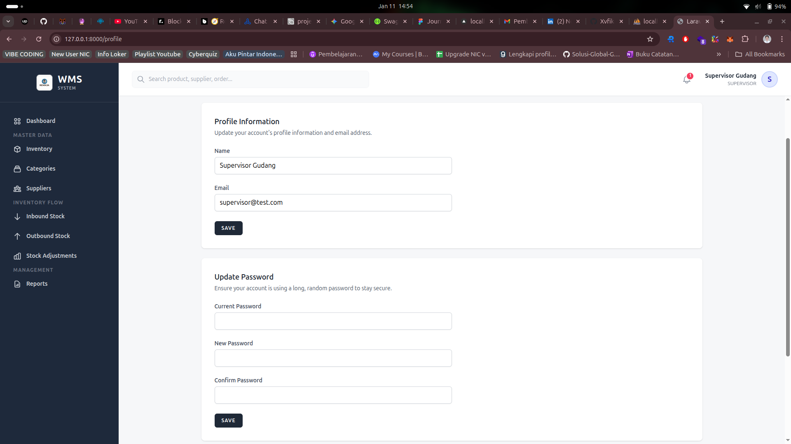
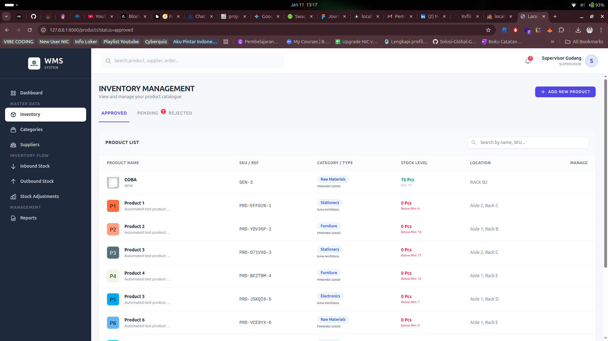
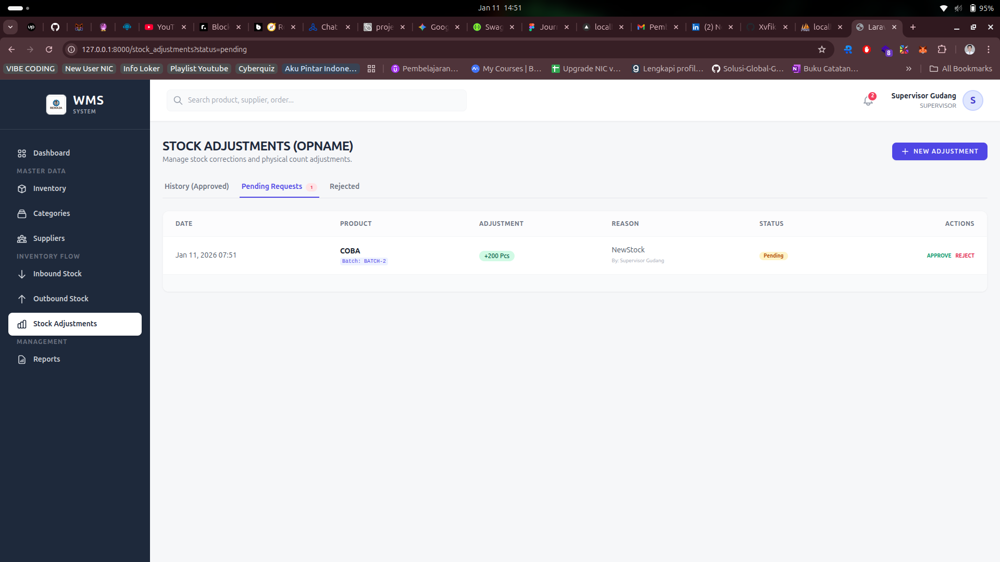
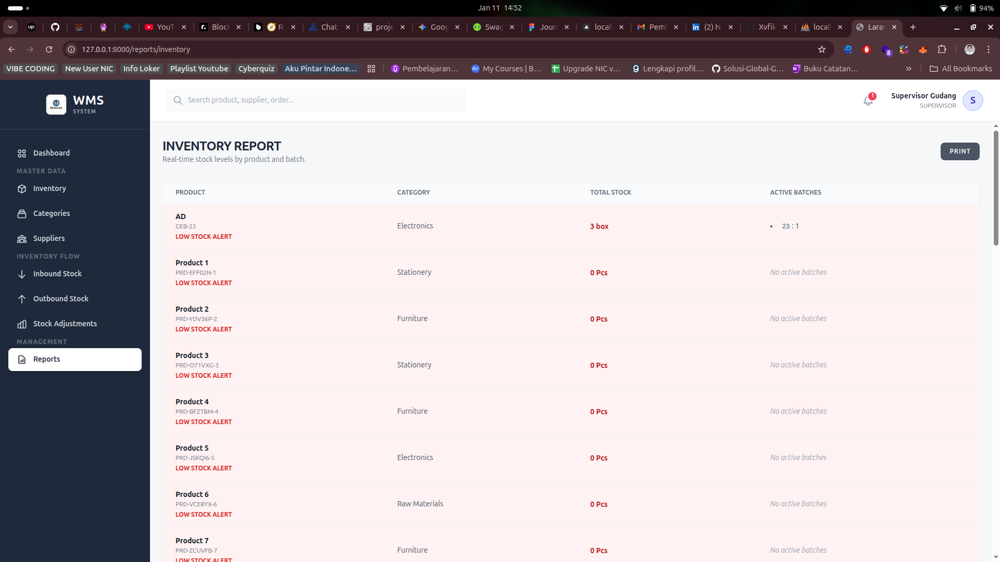

# Warehouse Management System (WMS)

A robust and efficient Warehouse Management System built with **Laravel 11**, designed to streamline inventory tracking, manage goods movement, and provide comprehensive reporting.

## 🚀 Key Features

- **Inventory Tracking**: Manage products, categories, and suppliers with ease.
- **Batch Management**: Track stock levels using batch numbers for better traceability.
- **Goods Movement**: Record and track Inbound and Outbound transactions.
- **Stock Adjustments**: Perform physical stock counts and record adjustments with approval workflows.
- **Reporting**: Generate daily, weekly, monthly, and annual reports in real-time.
- **Role-Based Access Control**: Separate dashboards for Admins, Supervisors, and Warehouse Staff.
- **Low Stock Notifications**: Automated alerts when inventory levels fall below thresholds.

## 📸 Project Previews

### Guest & Landing Page
| Dashboard | Features |
|---|---|
|  |  |
| **About Us** | **Login** |
|  |  |

### Admin & Supervisor Dashboard
| Overview Dashboard | User Management |
|---|---|
|  |  |

### Inventory & Stock Management
| Inventory List | Inbound Stock |
|---|---|
|  |  |
| **Stock Adjustment** | **Inventory Report** |
|  |  |

## 🛠️ Tech Stack

- **Framework**: [Laravel 11](https://laravel.com)
- **Styling**: [Tailwind CSS](https://tailwindcss.com)
- **Database**: MySQL / PostgreSQL
- **Frontend Interactivity**: Alpine.js / Blade Components

## ⚙️ Installation

1.  **Clone the repository**:
    ```bash
    git clone <repository-url>
    cd warehouse_system
    ```

2.  **Install dependencies**:
    ```bash
    composer install
    npm install
    ```

3.  **Setup environment**:
    ```bash
    cp .env.example .env
    php artisan key:generate
    ```

4.  **Database migration & seeding**:
    ```bash
    php artisan migrate --seed
    ```

5.  **Run the application**:
    ```bash
    npm run dev
    php artisan serve
    ```

## 📄 License

The Warehouse Management System is open-sourced software licensed under the [MIT license](https://opensource.org/licenses/MIT).
